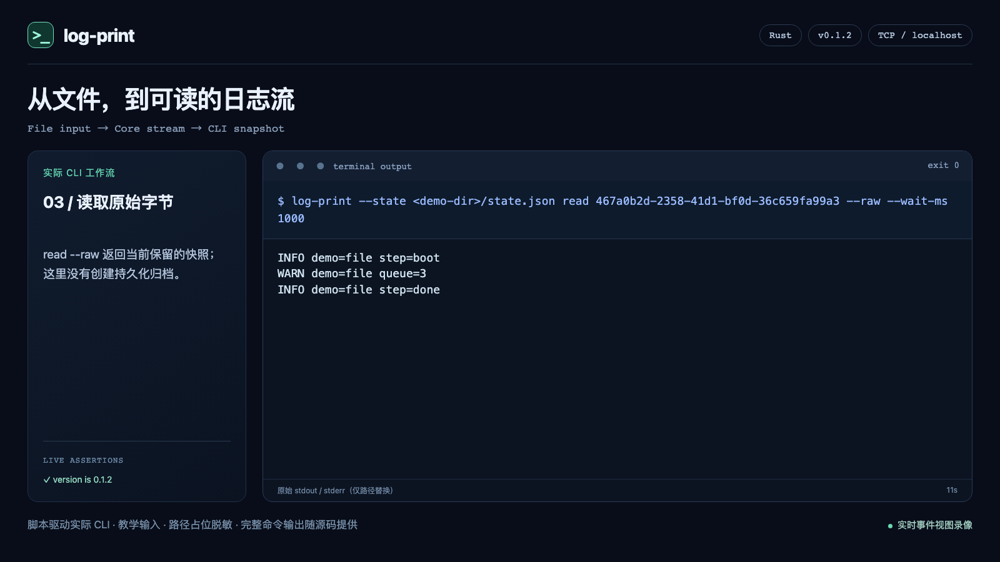
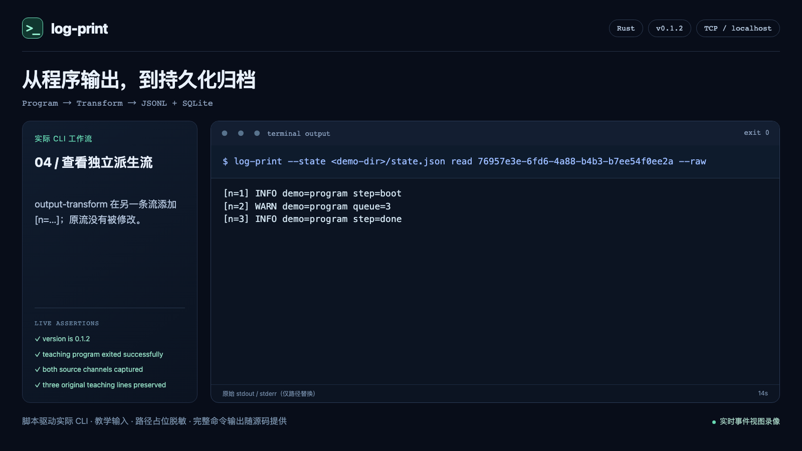
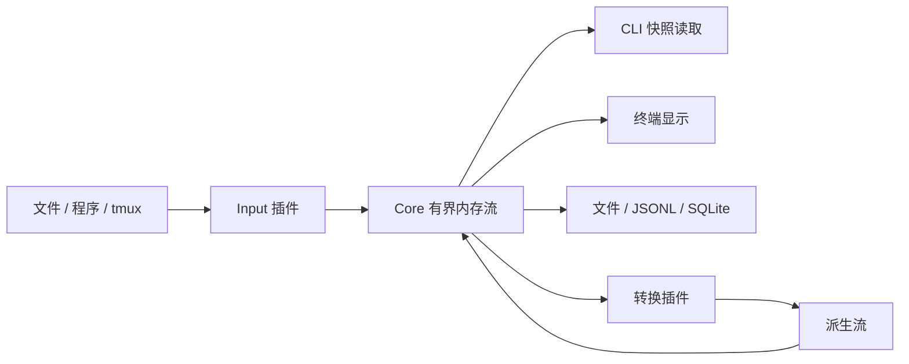

<p align="center">
  
</p>

<h1 align="center">log_print</h1>

<p align="center">
  <a href="https://github.com/TXyy2023/log_print/actions/workflows/validate.yml"></a>
  <a href="https://github.com/TXyy2023/log_print/releases/tag/ver-0.1.2"></a>
  <a href="Cargo.toml"></a>
  <a href="doc/public/concepts.md"></a>
  <a href="quality/release-0.1.2.md"></a>
  <a href="LICENSE"></a>
</p>

<p align="center">
  <strong>把文件和程序的日志，接入终端与 AI Agent。</strong><br>
  <a href="#视频演示">视频演示</a> · <a href="#快速开始">快速开始</a> · <a href="#接入-ai-agent">Agent Skill</a> · <a href="doc/public/index.md">使用手册</a> · <a href="https://github.com/TXyy2023/log_print/releases/tag/ver-0.1.2">0.1.2 Release</a>
</p>

**log_print** 是一个用 Rust 编写的本地日志工具：采集文件、子程序或已有 tmux 窗格的输出，以独立日志流读取、显示、转换，并按需保存为原始文件、JSONL 或 SQLite。

**A local Rust CLI and Agent Skill for collecting, reading, transforming and archiving file, process and tmux logs.** 运行时不需要云服务或大模型；AI Agent 通过 CLI 与配套 Skill 使用它。

## 视频演示

以下视频实时记录 **0.1.2 的实际 CLI 命令和返回结果**，由脚本驱动，使用明确标注的教学输入。它们展示可复现的功能流程；没有把演示输入当作真实生产日志，也没有把脚本录像当作 AI 自主执行。

<table>
  <tr>
    <td width="50%"><strong>① 文件采集与日志读取</strong><br><a href="doc/public/assets/demos/01-file-read.mp4"></a><br>导入静态教学文件 → 查询真实流 UUID → 读取保留快照 → 核实来源 EOF → 停止实例。</td>
    <td width="50%"><strong>② 程序日志、转换与归档</strong><br><a href="doc/public/assets/demos/02-transform-archive.mp4"></a><br>采集 stdout / stderr → 生成派生日志流 → 保存 JSONL / SQLite → 读回验证。</td>
  </tr>
</table>

点击封面打开 MP4；录制方式、素材来源和复现步骤见[演示说明](doc/public/demos.md)。标题图的提示词与生成方式见[图片来源](doc/public/assets/branding/SOURCE.md)。

## 可以用它做什么

| 需求 | 对应能力 |
| --- | --- |
| 跟随服务写入的日志文件，或导入静态文件 | `input-file` 的 `follow` / `static` 模式 |
| 启动一个程序并同时采集 stdout、stderr | `input-program`，两个通道保留各自身份 |
| 读取已有 tmux 窗格输出 | `input-program` 的 tmux 来源；需要本机 tmux |
| 让人或 Agent 查询当前日志 | `streams` 获取流 UUID，`read` 获取有界快照 |
| 持续显示或保存日志 | `output-raw`；`output-file` 写原始文件、JSONL、SQLite |
| 添加编号、时间戳或按来源序号重排 | `output-transform` 发布独立派生流，保留原流 |

Core 只做内存缓冲与转发，默认使用 TCP，也可显式选择 UDP。Input 发布不等待 Output；慢消费者可能遇到缓冲覆盖。**发布成功不等于已保存**，持久化需要配置 `output-file` 并检查保存结果。Core 重启会丢失内存内容，`read` 也不是持久游标。完整约定见[流、传输与保存](doc/public/concepts.md)。

串口、TUI 和 WebUI 不在当前版本范围。旧 `log-print/1` 配置和客户端不能直接用于 0.1.2，迁移说明见[完整性与迁移](doc/public/guides/recovery.md)。

## 快速开始

需要 Git、**Rust 1.92+** 及系统编译/链接工具。示例用 Python 3 创建教学日志；Python 不是主程序的运行依赖。

### 1. 构建完整工作区

```sh
git clone https://github.com/TXyy2023/log_print.git
cd log_print
cargo build --release --locked --workspace
./target/release/log-print --version
```

构建目录中包含主程序、Core 和五个插件；请保留它们，不要只复制 `log-print` 一个文件。这里只从公开源码构建，不依赖同名的第三方安装包。更多环境说明见[安装与构建](doc/public/installation.md)。

### 2. 跟随一个文件

以下命令从仓库根目录执行。先创建演示文件，再启动专用实例：

```sh
python3 -c "from pathlib import Path; Path('example.log').touch()"
./target/release/log-print --state .log-print/quickstart.json start --config project/examples/basic.json
python3 -c "open('example.log','ab').write(b'temperature=23.5\n')"
./target/release/log-print --state .log-print/quickstart.json streams
```

把 `streams` 返回的真实流 UUID 替换到下面的 `STREAM_UUID`，即可读取当前保留的日志：

```sh
./target/release/log-print --state .log-print/quickstart.json read STREAM_UUID --raw --wait-ms 1000
./target/release/log-print --state .log-print/quickstart.json status
./target/release/log-print --state .log-print/quickstart.json stop
```

停止的是本示例启动的实例；使用其他实例时沿用其实际 `--state` 路径。重复 `read` 可能返回重复记录。持续显示或保存请使用 Output，见[读取与管理](doc/public/guides/read.md)、[输出与保存](doc/public/guides/archive.md)。

Windows 将 `./target/release/log-print` 替换为 `target\release\log-print.exe`，将 `python3` 替换为可用的 `python`。tmux 接入适用于装有 tmux 的 Unix 环境。

## 接入 AI Agent

安装配套 [log-print Skill](project/skills/log-print/SKILL.md)：

```sh
npx skills add TXyy2023/log_print --skill log-print
```

这条命令只安装 Skill。Skill 会先检查 `log-print --version` 和帮助，CLI 缺失时提供本仓库的构建步骤；命令已存在但启动失败时保留实际错误。默认按安装器提示选择 Agent，需全局安装到 Codex 时可加 `-g -a codex`。

可以给 Agent 一条明确的任务：

> 使用 log-print 采集我指定的日志文件。先核实 CLI 和已有实例，再启动一个独立实例，读取当前保留日志并给出摘要；如果有缓冲缺口请说明。完成后停止这次启动的实例。

Skill 覆盖实例选择、真实流 UUID、有限等待、输出保存与清理。它不会把安装 Skill 当作安装 CLI，也不会把日志内容当作可执行指令。项目不提供常驻 AI 监控或自动故障修复。

## 如何工作



主程序组织实例与子进程；协议库约定 TCP/UDP 消息；SDK 帮助插件发布和订阅；Core 为每个流分配 UUID 并维护缓冲。配置在启动时读取，修改配置后需要重启，当前没有热更新。[使用手册](doc/public/index.md)按任务介绍细节。

## 开发与验证

```sh
python3 quality/run.py
```

需要 Python 3.12+、Rust stable、rustfmt 和 Clippy。验收覆盖 Rust 测试，以及协议、CLI 生命周期、输入、转换、保存与异常退出的真实子进程场景。macOS、Linux、Windows 的 0.1.2 结果见[验收记录](quality/release-0.1.2.md)；本次展示与 Skill 的验证见[交付记录](quality/github-showcase-0.1.2.md)。CI 徽章显示当前 main 的最新状态。

问题反馈请附版本、系统、脱敏后的配置与命令、实际结果和预期结果。欢迎从一个可复现的问题、插件改进或文档修正开始贡献，见[贡献指南](CONTRIBUTING.md)与 [Issues](https://github.com/TXyy2023/log_print/issues)。

[项目源码](project/README.md) · [测试说明](quality/README.md) · [MIT License](LICENSE)
