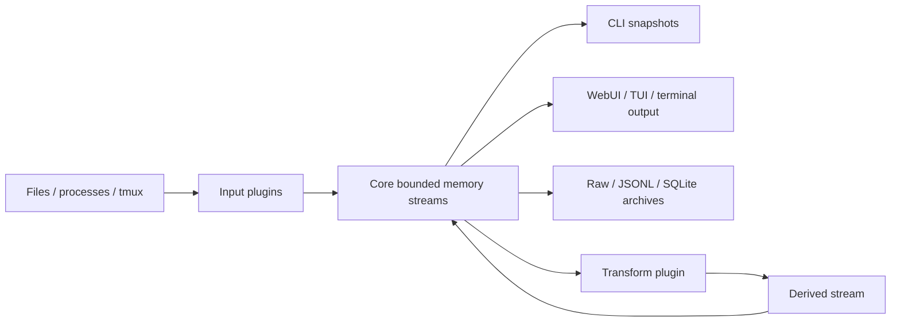

<p align="center">
  
</p>

<h1 align="center">log_print</h1>

<p align="center"><strong>English</strong> · <a href="README.zh-CN.md">简体中文</a></p>

<p align="center">
  <a href="https://github.com/TXyy2023/log_print/actions/workflows/validate.yml"></a>
  <a href="https://txyy2023.github.io/log_print/"></a>
  <a href="https://github.com/TXyy2023/log_print/releases/tag/ver-0.1.2"></a>
  <a href="Cargo.toml"></a>
  <a href="doc/public/concepts.md"></a>
  <a href="quality/release-0.1.2.md"></a>
  <a href="LICENSE"></a>
</p>

<p align="center">
  <strong>Local logs, in your terminal, browser and AI workflow.</strong><br>
  <a href="#quick-start">Quick start</a> · <a href="#ai-agent-integration">Agent Skill</a> · <a href="https://TXyy2023.github.io/log_print/">Documentation</a> · <a href="doc/public/index.md">Manual source</a> · <a href="https://github.com/TXyy2023/log_print/releases/tag/ver-0.1.2">0.1.2 Release</a>
</p>

**log_print** is a local Rust toolkit for collecting, viewing, transforming and archiving logs from files, child processes and existing tmux panes. Use a CLI, a browser workbench or a terminal workbench, with the same stream identities and explicit persistence boundaries.

No cloud service or language model is required at runtime. AI agents can use the CLI and the companion Skill to inspect logs and arrange workbench panels.

## What it does

| Task | Capability |
| --- | --- |
| Follow a growing file or import a static file | `input-file` follow/static modes |
| Launch a program and collect stdout/stderr | `input-program`, preserving channel identity |
| Capture new output from an existing tmux pane | `input-program` tmux mode on Unix |
| Inspect current logs from a shell or agent | Stream discovery and bounded snapshot reads |
| Arrange persistent Pages, log tables and curves | `output-webui` freeform canvas, synchronized through CLI |
| Use the same workbench in a terminal | `output-tui`, including attachment to an existing WebUI |
| Display or archive continuously | `output-raw`; `output-file` for raw files, JSONL and SQLite |
| Add numbering, timestamps or source-sequence reordering | `output-transform`, publishing a separate derived stream |


The workbench above uses synthetic data and CLI-arranged panels. [WebUI](doc/public/plugins/output-webui.md) and [TUI](doc/public/plugins/output-tui.md) share the Rust display/history engine. Optional SQLite archiving enables queries beyond Core's memory buffer.

Core buffers and routes logs in memory, using TCP by default or optional UDP. Inputs do not wait for Outputs, and slow consumers can lose overwritten records. **Published does not mean persisted.** Configure `output-file` and inspect its commit results when you need storage. Core restarts discard its memory, and `read` is not a persistent cursor. See [streams and persistence](doc/public/concepts.md).

Serial input is outside the current workspace. Old `log-print/1` clients and configurations need [migration](doc/public/guides/recovery.md). The workspace version remains 0.1.2, but current `main` includes features added after the original release tag; build binaries from the same revision as the manual.

## Documentation

**English is the default.** The complete public manual is available in both languages, with localized navigation and full-text search:

- [English manual](https://txyy2023.github.io/log_print/) · [简体中文手册](https://txyy2023.github.io/log_print/zh/)
- [Quick start](https://txyy2023.github.io/log_print/quickstart.html) · [CLI](https://txyy2023.github.io/log_print/reference/cli.html) · [Configuration](https://txyy2023.github.io/log_print/reference/configuration.html) · [Troubleshooting](https://txyy2023.github.io/log_print/troubleshooting.html)

The language menu switches to the corresponding page. Markdown in [`doc/public/`](doc/public/index.md) is the source for both GitHub and the site; Chinese translations live in [`doc/public/zh/`](doc/public/zh/index.md).

## Quick start

You need Git, **Rust 1.92+** and platform compiler/linker tools. Python 3 generates the sample log; it is not an application runtime dependency.

### 1. Build the workspace

```sh
git clone https://github.com/TXyy2023/log_print.git
cd log_print
cargo build --release --locked --workspace
./target/release/log-print --version
```

Keep the CLI, Core and all seven plugin executables together in the build directory. This builds the public source rather than installing a similarly named third-party package. See [installation](doc/public/installation.md).

### 2. Follow a file

From the repository root, create a sample file and start a dedicated instance:

```sh
python3 -c "from pathlib import Path; Path('example.log').touch()"
./target/release/log-print --state .log-print/quickstart.json start --input-file source=./example.log
python3 -c "open('example.log','ab').write(b'temperature=23.5\n')"
./target/release/log-print --state .log-print/quickstart.json streams
```

Replace `STREAM_UUID` with the actual UUID returned by `streams`:

```sh
./target/release/log-print --state .log-print/quickstart.json read STREAM_UUID --wait-ms 1000
./target/release/log-print --state .log-print/quickstart.json status
./target/release/log-print --state .log-print/quickstart.json stop
```

Commands return text and tables. Use `read --raw` for exact bytes, or `--config FILE` for an existing configuration. Always keep the same `--state` path when operating on an instance. Repeated reads may repeat records; use an Output for continuous display or archiving. See [reading](doc/public/guides/read.md) and [archiving](doc/public/guides/archive.md).

On Windows, use `target\release\log-print.exe` and your available `python` command. tmux attachment requires Unix and tmux.

### 3. Open a workbench

Start a new instance with a browser or terminal Output:

```sh
./target/release/log-print --state .log-print/workbench.json start \
  --input-file source=./example.log --output-webui web
./target/release/log-print --state .log-print/workbench.json webui web url
# Optional: attach a terminal to that same workbench
./target/release/log-print --state .log-print/workbench.json tui web attach
# After exiting the terminal view, stop this instance when finished
./target/release/log-print --state .log-print/workbench.json stop
```

For a terminal-only backend, use `--output-tui term` and `tui term attach`. History defaults to retained memory; add `--webui-archive web=./capture` or `--tui-archive term=./capture` at startup for a new companion archive. See the workbench guides for coverage, layout and CLI commands.

## AI agent integration

Install the companion [log-print Skill](project/skills/log-print/SKILL.md):

```sh
npx skills add TXyy2023/log_print --skill log-print
```

This installs the Skill, not the CLI. The Skill checks `log-print --version` and help first, provides source build instructions if missing, and preserves actual startup errors. Follow the installer's agent selection prompts; add `-g -a codex` for a global Codex installation.

Example task:

> Use log-print to collect the log file I specify. Check the CLI and existing instances first, then start a separate instance, read retained logs and summarize them. Report any buffer gaps. Stop only the instance you started when finished.

The Skill covers instance selection, actual stream UUIDs, bounded waits, persistence and cleanup. Log content is treated as data, not executable instructions. The project does not provide a resident AI monitor or automatic fault repair.

## How it works


```mermaid
flowchart LR
    A[Files / processes / tmux] --> B[Input plugins]
    B --> C[Core bounded memory streams]
    C --> D[CLI snapshots]
    C --> E[WebUI / TUI / terminal output]
    C --> F[Raw / JSONL / SQLite archives]
    C --> G[Transform plugin]
    G --> H[Derived stream]
    H --> C
```

The main program supervises the instance and child processes. The protocol defines TCP/UDP messages; the Rust SDK supports publishing and subscribing; Core assigns UUIDs and maintains buffers. Startup configuration changes require restarting the instance. Workbench display state can be edited live through the shared backend and CLI.

## Development and validation

```sh
python3 quality/run.py
```

The full suite needs Python 3.12+, Node.js 24/npm, Rust stable, rustfmt and Clippy. It covers Rust tests and real subprocess scenarios for the protocol, CLI lifecycle, inputs, transformations, archives, WebUI/TUI and failures. GitHub CI runs Linux, macOS and Windows, including real PTY/ConPTY terminal interactions and Chromium workbench tests. See [validation instructions](quality/README.md); the CI badge reports current main status. The [original 0.1.2 report](quality/release-0.1.2.md) describes its release revision, not every later change.

Documentation changes must pass both root-path and GitHub Pages subpath builds, locale/link checks and public-content isolation. The [Documentation workflow](https://github.com/TXyy2023/log_print/actions/workflows/docs.yml) validates `dev` and `main`, and deploys `main` to GitHub Pages. Internal development notes remain local. See [site maintenance](doc/site/README.md).

Report issues with the commit/version, OS, sanitized configuration, reproduction commands, actual results and expected behavior. See [Contributing](CONTRIBUTING.md) and [Issues](https://github.com/TXyy2023/log_print/issues).

[Source layout](project/README.md) · [MIT License](LICENSE)
