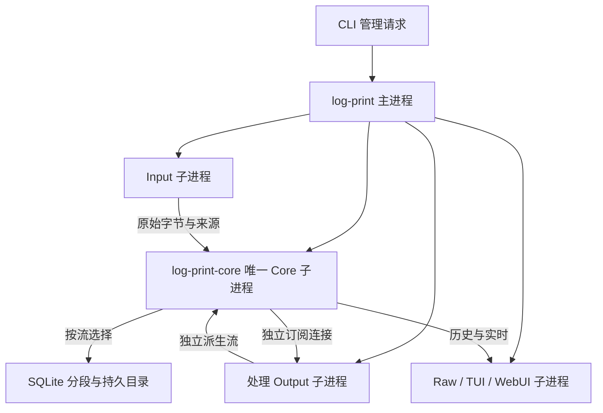

# 正式版本架构

本文件描述正式 `log-print/1` 实现，2026-09-08。原 MVP 架构原件在 `local-archive/mvp-v2/worktree/doc/architecture.md`，不再作为运行入口。

主进程负责配置、唯一 Core 的先行启动、各插件的独立启停和状态、实例内进程回收。Core 和插件均为它的直接子进程。Input 启动的被采集程序是该 Input 的后代；它负责其进程组/Windows Job Object 的清理。CLI 不属于数据转发路径。

Core 负责权限、流标识、顺序、有界缓存、保存和统一读取。采集、业务分行、转换、数值提取、绘图均由插件完成。Input/Output 是主要用途名称，同一插件可以订阅、处理并发布新的流。官方插件和公共库统一构建，但 Core/协议/SDK 不依赖具体插件。

## 数据和控制隔离

插件使用一条请求/控制连接、每条订阅一条事件连接；均是随机 loopback 地址上的 TCP，设置 TCP_NODELAY。JSONL 是有界的传输帧，不限制原始日志必须含换行。原始字节编码成 JSON 字节数组；stdout 可直接用于原样日志或 TUI。

Core 的事件发送等候对应 socket，不阻塞其他订阅。SDK 事件队列有界，控制连接持续处理发布确认和控制调用。SDK 独立发送任务保证调用方取消不会留下半帧。处理插件在收到事件后发布派生内容不会与数据队列互等。

每流独立锁和存储对象；SQLite 工作在阻塞工作线程，不把磁盘写入放进 Tokio 的网络读写任务。状态/配置/父进度查询可能需要等正在进行的单流操作，不承诺磁盘永久无响应时还能立即取得该流状态。首版没有运行时 watchdog。

## 身份、顺序与派生

配置声明 plugin id、可读流、自己拥有的流及 parents。每流只允许其 owner 发布；管理员可读取和管理，不能冒充 owner 发布。禁止重复身份、未知流、声明父关系环和插件 reads 造成的处理反馈环。

记录包含 `stream + epoch + seq`、幂等 key、原始 bytes、源时间（可无）、Core 观测时间、父 seq 和父 epoch。序号保证流内顺序；跨流没有全局时间顺序承诺。父游标表示处理进度，不能解释为精确的跨流因果分析。

保存流在重启后保留 epoch；未保存流重新开始并更换 epoch。API 提供 epoch 校验，客户端不能只保存裸 seq 后盲目用于新实例。派生记录也带父 epoch，避免跨重启混淆同序号来源。

## 历史、实时与故障

读取从缓冲或保存文件中返回有界批次。订阅按同一游标连续读取；追平后等 Notify，有新数据即继续，不按固定时间轮询 Core。注册通知先于查询，避免历史转实时的通知竞态。文件 Input 为跨平台文件跟随采用可配置检查间隔，它与 Output 实时订阅机制不同。

保存使用每流分段 SQLite（DELETE journal、synchronous EXTRA）。记录、幂等 key、该分段提交 head 同一事务写入；独立持久分段目录用于发现尾段/全部段丢失。历史文件不会自动删除。故障流阻塞发布，其他流仍可继续；手动 resume 重新检查文件、目录、身份、epoch 和可用 head。

插件报告失败、断开和未完成数据。主进程不自动重启插件。正常停止先请求插件关闭，等候有界时间，收回仍未退出的自有进程，再关闭 Core。强制终止和硬件无法反压可能存在未知丢失量，报告不能把它写成零。
