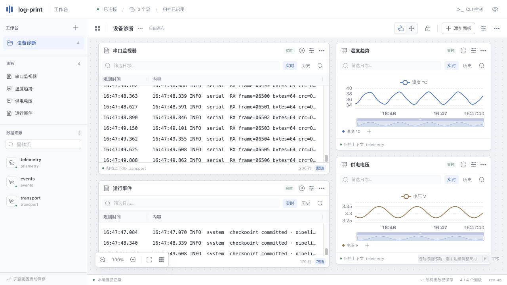

<span id="output-webui-自由工作台与历史上下文"></span>

# output-webui: workbench and history

A local Rust/Axum backend reads Core through the current SDK. The frontend uses Vue 3, Element Plus, a Vue Flow freeform canvas, GridStack's Vue integration, AG Grid Community and ECharts. Built assets are embedded in the Rust executable; running it needs no Node.js, CDN or internet connection.

```sh
log-print start --input-file source=./app.log --output-webui web
log-print webui web url
```

The default live mode does not promise complete history. Add `--webui-archive web=./capture` at startup to create this run's all-stream SQLite archive, or use `--output-sqlite archive=./capture/run.sqlite --webui-history web=archive` to bind an explicitly configured archive in the same instance. The two archive options are mutually exclusive and never overwrite existing files.



The screenshot uses synthetic serial-style text and temperature/voltage samples, with panels arranged through the CLI. It does not demonstrate a hardware serial-input plugin.

<span id="工作台操作"></span>

## Workbench controls

The left sidebar lists Pages, panels and all sources. Click a source to add a bound log panel. The canvas displays configured logs and curves: drag a title to move a panel and use its handles to resize it. The right inspector edits position, size, source, channel, font and row height; Apply submits the changes. Filtering, pause, follow and history navigation stay inside each panel. Expand coverage details from its footer.

New Pages use the freeform canvas. Panels can overlap, move forward/backward, hide and lock. Shortcuts: `V` selects, `H` pans, `0` fits all, `+`/`-` zoom. Scroll to pan and pinch to zoom. The sidebar, inspector, minimap and dot grid can be hidden. Table scrolling and chart zoom use their respective components.

Existing Pages retain their 12-column GridStack layouts. Switch between canvas and grid in the workbench menu; both geometries are stored separately so pixel positions do not overwrite legacy grid coordinates. Filters, source bindings and curve definitions survive switching.

<span id="page-与-cli"></span>

## Pages and CLI control

An AI agent or script can arrange the interface entirely through CLI options, without browser automation or handwritten JSON. `page get` and `panel get` inspect state. Use returned UUIDs in subsequent commands; `capabilities` reports layout capabilities and limits.

```sh
log-print webui web page create --name monitor --title 'Device diagnostics' --layout-mode canvas
log-print webui web page select --page monitor
log-print webui web panel add --kind log --title 'Device logs' --stream source \
  --left 24 --top 24 --panel-width 760 --panel-height 480
log-print webui web panel add --kind curve --title 'Temperature' --stream source \
  --left 808 --top 24 --panel-width 520 --panel-height 340
log-print webui web series add --panel CURVE_UUID --name temperature \
  --regex 'temperature=(?P<value>[0-9.]+)' --color '#4777c4' --width 2
log-print webui web panel set --panel LOG_UUID --font-size 13 --row-height 30 --follow true
log-print webui web panel clone --panel LOG_UUID --title 'Errors' --text ERROR
log-print webui web panel set --panel LOG_UUID --hidden false --locked false --z-index 3
log-print webui web layout set --page monitor \
  --place LOG_UUID=24,24,760,480 --place CURVE_UUID=808,24,520,340
log-print webui web page set --page monitor --view-x 24 --view-y 24 --view-zoom 0.8 \
  --show-grid true --snap true --show-minimap false --sidebar-open true --inspector-open false
```

Replace `LOG_UUID` and `CURVE_UUID` with IDs returned by `panel add`.

| Display state | Named options and limits |
| --- | --- |
| Layout mode | `--layout-mode canvas\|grid` |
| Canvas geometry | `--left` / `--top` accept negatives and fractions within ±1,000,000; `--panel-width` 320–4000; `--panel-height` 220–4000, in pixels |
| Grid geometry | Existing `--x` / `--y` / `--w` / `--h`, using 12 columns |
| Atomic layout | Repeat `--place UUID=LEFT,TOP,WIDTH,HEIGHT`; any invalid item rejects the entire batch |
| Stacking and visibility | `--z-index` 0–1,000,000; `--hidden true\|false`; `--locked true\|false` |
| Typography | `--font-size` 10–24; `--row-height` 22–56 |
| Viewport | `--view-x` / `--view-y` ±1,000,000; `--view-zoom` 0.2–2; `--tool select\|pan` |
| Page appearance | `--theme light\|dark`, `--show-grid`, `--snap`, `--show-minimap`, `--sidebar-open`, `--inspector-open`; supply explicit true or false for booleans |
| Selection | `--active-panel UUID` or `--clear-active-panel` |

Page configuration, layout, viewport, display settings, filters, curve definitions and current Page are persisted in a separate SQLite database. Vue Flow/GridStack moves and resizes, AG Grid column settings, and ECharts zoom/legend changes are submitted to Rust. CLI and browsers share the same engine, including viewport state. Browser edits carry their starting revision; stale writes are rejected and committed state restored. CLI can use `--revision` for the same check. Locking prevents browser dragging; CLI can still update exact positions.

Bindings persist owner/alias and resolve UUIDs in the current Core run. Missing sources remain in a waiting state. Cold startup restores configuration and rebinds current streams, without loading the previous run's logs. Log panels support multiple streams, channel/text/regex filters, and text/hex display. Curves support multiple series, named regex capture group `value` or JSON field paths, time/axis ranges, colors and line widths.

<span id="全量上下文与覆盖边界"></span>

## Historical context and coverage

```sh
log-print webui web history search --stream source --regex ERROR
log-print webui web history context --stream source --epoch EPOCH --seq 123 --byte-offset 20 --before 10 --after 10
log-print webui web history curve --stream source --field metrics.temperature
log-print webui web query get --query QUERY_UUID --offset 0 --limit 200
log-print webui web query cancel --query QUERY_UUID
```

History commands return task IDs. Each query fixes SQLite commit watermarks and Core epoch/head boundaries, then merges, deduplicates and paginates results. Records retain identity and byte offsets. Live and historical views share line assembly across Records and numeric extraction, keeping stdout/stderr context separate. At most two background scans run concurrently. Log pages contain at most 200 rows, and historical curves at most 2000 plotted points. CLI replies also obey TCP/UDP frame budgets.

UI and CLI report archive start/commit watermarks, memory ranges, uncovered prefixes, gaps, uncommitted data and archive failures. Committed prefixes remain readable after archiving stops. Without an archive, history uses only currently retained Core memory. New SQLite archives use schema 3; the reader also supports schema 2. Raw/JSONL formats are unchanged and existing archives are not automatically migrated. Core does not access the database.

Default live cache limits are 4096 Records or 4 MiB per stream, with a 64 MiB total record budget. Browsers retain bounded result pages. Pausing display keeps collection running. Query temporary files are separate from the Page database; restart clears temporary query positions.

See the [CLI reference](../reference/cli.md), [configuration](../reference/configuration.md) and [output-file](output-file.md).

<span id="与终端同步"></span>

## Share a workbench with a terminal

`log-print tui web attach` connects to the same backend, sharing Pages, settings and history positions with browsers. The shared state/history engine lives in `project/crates/log-view`; Core credentials stay in the Output backend. Terminal fonts and curve strokes are constrained by the character grid.
